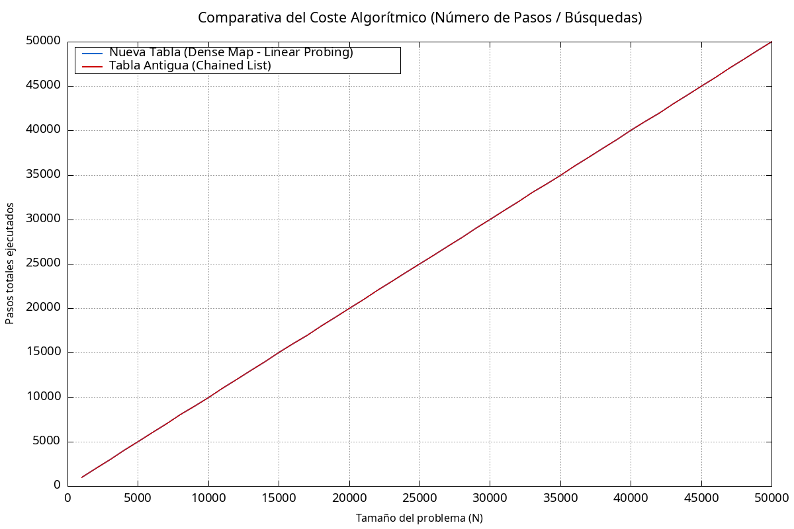
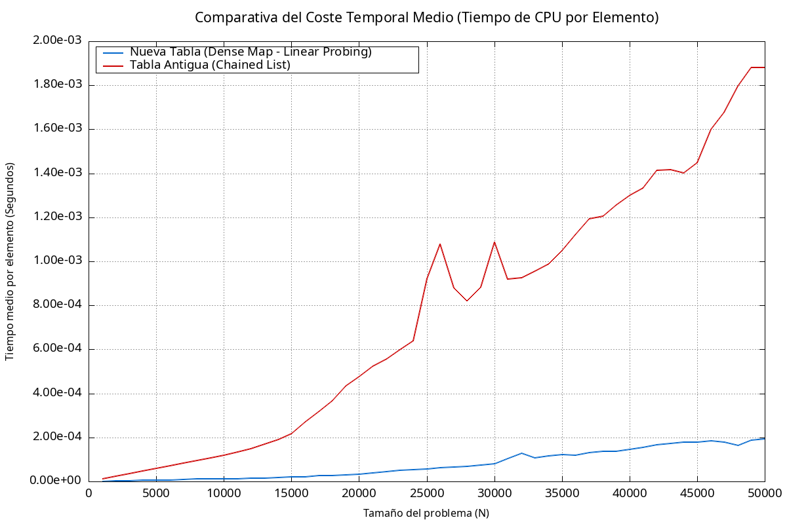

# Evaluation of Hash Tables

Note: Some parts of this section are in spanish, do not expect it to be translated ever... Sorry!

## Introduction

This little corner contains a comparative analysis of the performance (Temporal and Step costs) for each of the implemented hash tables, in order to evaluate its feasibility in the TopologFX engine program.
We are testing:
- The standard Chained Hash Table (found in `HashTableOld.h`)
- The Sparse Dense Hash Table (currently in-use, found in `engine/core/HashTable.h`)

## Building & Running

To perform the evaluation, navigate to the folder `tests/HashTableComparation`, and execute in the shell:

```bash
chmod +x run_test.sh
./run_test.sh
```

This will execute the commands in the following order:

1. Compile the source file `Evaluate.cpp` using g++ compiler.
2. Execute the generated executable.
3. Plot the results using the GNUPLOT script `script.p` and generating the respective png images.
4. Remove the temporal generated binaries.

## Results

After the script is run, the following two images are generated in the folder:





### Veredict
Whilst the algorithmical cost is identical in theory and practice (both are indeed _O(1)_ steps per operation); in the temporal costs, the new Hash Table outperforms the old one. 

This difference is due to how we arrange memory layouts in a smart way. As we can see in these three points:

1. Spatial Locality & CPU Cache Mechanics
- Dense Hash Table (new):
    We can achieve near-perfect spatial locality by storing every key-value pairs in a single contiguous array `std::vector<PairData> dense_data`.
    When the program requests an entity (i.e. for instance, to compute a transformation), the hardware prefetcher loads an entire cache line containing adjacent elements. Thus, for consulting neighborhoods, we have already precomputed them.

- The Chained Hash Map (old):
    We did use a `std::vector` of `std::list`s to solve collisions. However, as a linked list relies on dynamic node allocation, this makes the hash table to store each node scattered across the heap, and creating empty spaces. This causes invalidations in the prefetcher logic, thus triggering *cache misses*. 

2. Pointer Indirection & Control Overhead
- Dense Hash Table (new):
    It stores elements by value inside a static array.
    Finding an element requires a simple index arithmetic to map its hash index to the data offset.

- The Chained Hash Map (old):
    In this table we used multiple pointer indirections. Only for accessing a single entity node, we perform:
        Evaluate the vector
        Dereference the head node of the `std::list`
        Iterate over the next node pointers
    Thus introducing delay for each consult.

3. Allocation & Computational Footprint
- In the new Hash Table, we don't need the `std::list` memory management overhead, because of it is defined.